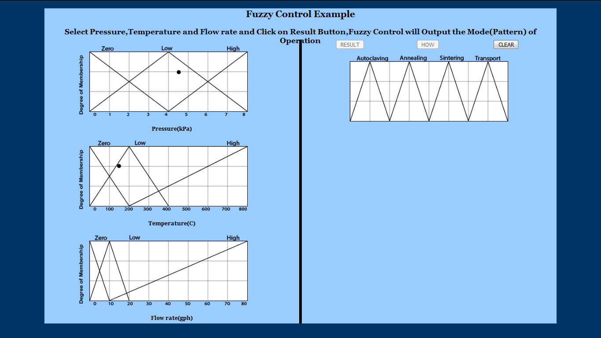
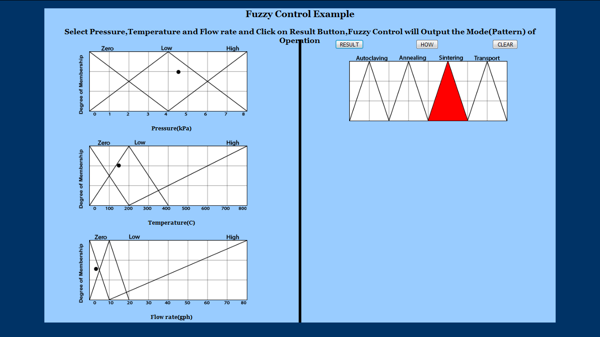
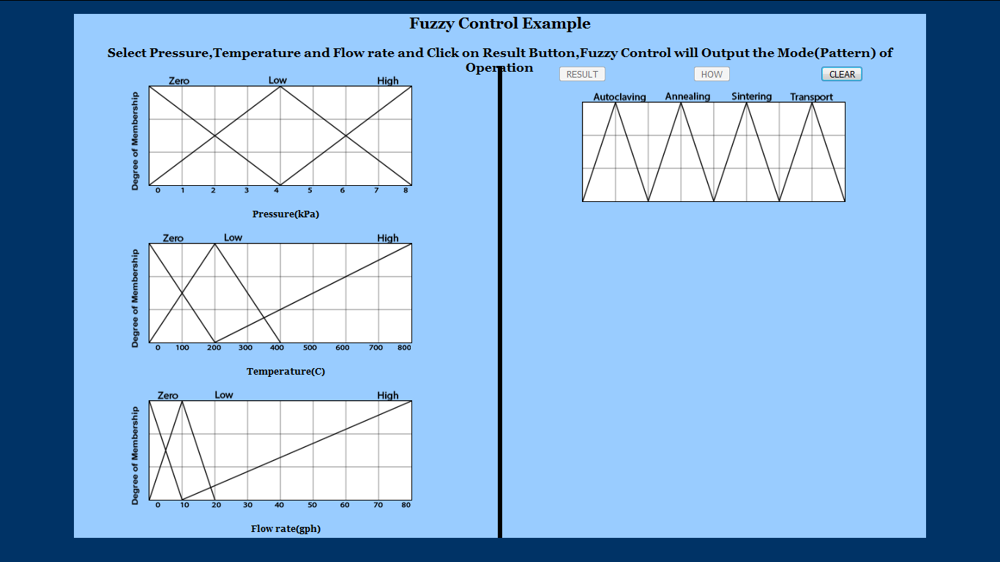

# Procedure

1. Click arbitrarily on the mess to input Pressure.

2. Click arbitrarily on the mess to input Temperature.

3. Click arbitrarily on the mess to input Flowrate.

4. Click Result button to check what operation was performed.

5. Click on How? Button to know How fuzzy Control arrived at the Conclusion (Maximum Value Taken).

step5

6. Click on Clear Button and Perform the experiment again.

